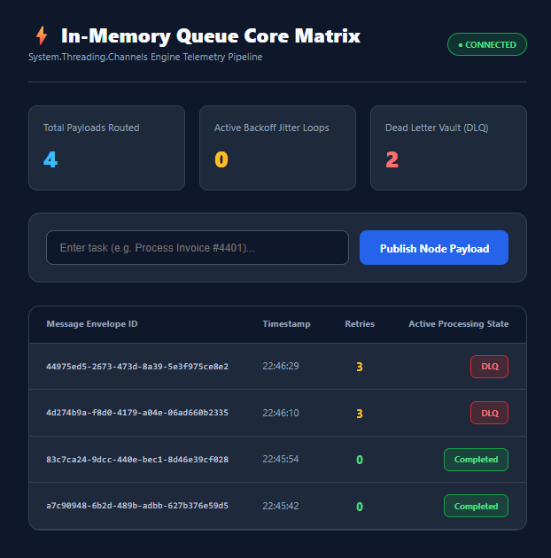

# ⚡ In-Memory Queue Core Matrix Pipeline

A high-throughput, real-time message processing simulation architecture built using .NET Core's thread-safe `System.Threading.Channels` infrastructure on the backend and an optimized dark-mode React dashboard on the frontend. It features deterministic testing capabilities for exponential backoff with random jitter and Dead Letter Queue (DLQ) state handling via native Server-Sent Events (SSE).

## 

## 📂 Project Architecture

```text
├── backend/                  # .NET Core 8.0/9.0 Minimal API Engine
│   ├── Queue/                # Channels core data architecture
│   │   ├── InMemoryChannelQueue.cs
│   │   ├── Consumer.cs
│   │   └── Pubslisher.cs
│   ├── Program.cs            # API configuration, SSE engine, CORS setup
│   └── InMemoryQueue.csproj
├── frontend/                 # Vite + React UI Control Panel
│   ├── src/
│   │   ├── App.jsx           # Main real-time telemetry matrix component
│   │   └── main.jsx
│   ├── package.json
│   └── vite.config.js
└── README.md                 # System Root Orchestration Guide
```

# 🛠️ Global Development Environment Prerequisites

### Ensure you have the following frameworks installed locally on your machine before setup:

- .NET SDK 10.0 (Verify via: dotnet --version)
- Node.js (v18+) & npm (Verify via: node -v and npm -v)

# 🚀 Rapid Initialization Sequence

### To get the end-to-end telemetry system running instantly:

## Phase A: Booting the .NET Core Engine

1. Open a new terminal instance and navigate to the backend application folder:

```bash
cd backend
```

2. Restore internal packages and launch the execution thread:

```bash
dotnet run
```

3. The terminal will explicitly log that it is listening on local port 5000: Now listening on: http://localhost:5000. Keep this window running.

### Phase B: Launching the React Dashboard

1. Open a second independent terminal instance and navigate to the UI module folder:

```bash
cd frontend
```

2. Install the lightweight development node modules:

```bash
npm install
```

3. Boot the local Vite client:

```bash
npm run dev
```

4. Open your browser and navigate to the address displayed in the terminal output (typically http://localhost:5173).

# 🧪 Pipeline Verification Checklist

### To confirm that the end-to-end memory buffers, SSE streams, and component loops are operating optimally:

#### 1. Verification of Connection States

- When the web page loads, verify that the application header connection status badge reads ● CONNECTED in bright green.

- Open your browser's Developer Tools (F12), head to the Network tab, and locate the queue-stream row. The network Type must show as eventsource and its Status must remain continuously (pending) while accumulating response body bytes over time.

### 2. Functional Lifecycle Testing

#### Test the core architecture by inputting specific strings into the payload dashboard:

- Verify Clean Completion Pathway:

  Type Success item #1 or Completed task into the terminal text interface and click Publish Node Payload. The item will enter Processing status for exactly 1 second, turn green, and register as COMPLETED while updating the Tot$al Payloads Routed card.

- Verify Exponential Backoff & DLQ Pathway:

  Type Trigger DLQ error or Fail payload into the form and submit it. The entry will fail deterministically. You will see the Retries integer tick up ($1 \rightarrow 2 \rightarrow 3$) in real-time under an amber RETRYING badge while updating the Active Backoff Jitter Loops metric card. After the final attempt is exhausted, the row will seamlessly flash red, updating to a DLQ status and incrementing the Dead Letter Vault card.
